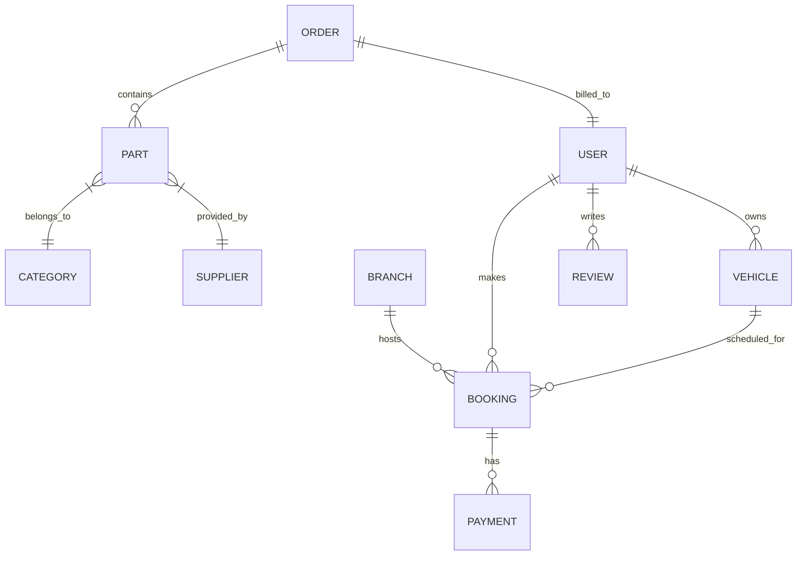

# Milestone 1 (Week 25 – April 29, 2026)

## Task 1: Project Setup
- **Backend:** ASP.NET Core Web API project successfully created and configured.
- **Frontend:** React (Vite) project with TypeScript and Tailwind CSS successfully created.

## Task 2: Feature Development
- **Total Features Implemented:** 15+ (Combined Frontend + Backend)
- **Status:** All progress regularly pushed to GitHub.
- **Team Contribution:** Each member has completed at least 2 core features.

---

## Task 3: Report Submission

### a) Project Overview
- **Purpose:** To provide a comprehensive management system for vehicle parts sales, inventory tracking, and service booking (VPSIMS).
- **Scope:** The system covers customer registrations, vehicle management, service appointments, inventory control, vendor procurement, and financial reporting.
- **Objectives:**
    - Streamline inventory management for automotive businesses.
    - Provide a seamless booking experience for customers.
    - Automate invoice generation and payment processing.
    - Enable data-driven decisions through advanced reporting and analytics.

### b) Technology Stack
- **Frameworks:** 
    - **Backend:** ASP.NET Core Web API, Entity Framework Core
    - **Frontend:** React 18 (Vite), TypeScript, Tailwind CSS
- **External Libraries:**
    - **Backend:** AutoMapper, Hangfire (Background Jobs), QuestPDF (Invoicing), Stripe (Payments), DotNetEnv.
    - **Frontend:** TanStack Query, Framer Motion, Radix UI, Recharts, Lucide React, Axios.
- **Database:** PostgreSQL
- **Deployment:** [Optional/Pending]

### c) Features and Functionalities

#### Feature Completion Status
| Feature ID | Feature Name | Status |
| :--- | :--- | :--- |
| F01 | User Authentication & RBAC (JWT) | Completed |
| F02 | Service Booking & Appointment System | Completed |
| F03 | Inventory & Vehicle Parts Management | Completed |
| F04 | Vendor/Supplier Procurement Workflow | Completed |
| F05 | Stripe Payment Integration | Completed |
| F06 | Automated Email & In-app Notifications | Completed |
| F07 | PDF Invoice Generation (QuestPDF) | Completed |
| F08 | Sales & Analytics Dashboards | Completed |
| F09 | Customer & Vehicle Profile Management | Completed |
| F10 | Support Ticket & FAQ System | Completed |
| F11 | Review & Rating Moderation | Completed |
| F12 | AI-based Maintenance Predictions | Completed |

#### Completed Features Detail

1. **User Authentication & RBAC**
   - Secure login and registration for Customers, Staff, and Admins.
   - **Endpoints:**
     - `POST /api/Auth/login` – Authenticates user and returns JWT.
     - `POST /api/Auth/register` – Registers a new customer profile.

2. **Service Booking System**
   - Full lifecycle management of service appointments.
   - **Endpoints:**
     - `GET /api/Booking` – Retrieves all bookings (Admin/Staff).
     - `POST /api/Booking` – Creates a new appointment request.
     - `PUT /api/Booking/{id}/status` – Updates booking status (Approve/Reject).

3. **Inventory Management**
   - Real-time tracking of parts, categories, and stock levels.
   - **Endpoints:**
     - `GET /api/Part` – Lists all available vehicle parts.
     - `POST /api/Part` – Adds new inventory items.

4. **Payment Processing**
   - Integrated with Stripe for secure online transactions.
   - **Endpoints:**
     - `POST /api/Stripe/create-checkout-session` – Initiates payment flow.

5. **Reporting & Analytics**
   - Dynamic charts for sales and customer engagement.
   - **Endpoints:**
     - `GET /api/Dashboard/stats` – Retrieves high-level business metrics.

*(Screenshots of the application interfaces are attached in the documentation folder)*

---

### d) Proof of Work (PoW)

#### Data Modeling (ER Diagram)

### e) Individual Reflection

#### Task Division
| Member Name | Primary Tasks |
| :--- | :--- |
| **Member 1 (Lead)** | Backend Architecture, Authentication, Stripe Integration |
| **Member 2** | Frontend Dashboard, Recharts Integration, UI Theme |
| **Member 3** | Inventory Management, Supplier Workflow, PDF Generation |
| **Member 4** | Booking System, Notification Service, Email Templates |
| **Member 5** | Support Ticket System, FAQ Management, Review Moderation |

---

### f) References

1. Microsoft. (2026). *ASP.NET Core Documentation*. Retrieved from https://learn.microsoft.com/en-us/aspnet/core
2. Meta Platforms, Inc. (2026). *React – A JavaScript library for building user interfaces*. Retrieved from https://react.dev
3. Tailwind Labs. (2026). *Tailwind CSS - Rapidly build modern websites without ever leaving your HTML*. Retrieved from https://tailwindcss.com
4. Shadcn. (2026). *shadcn/ui - Beautifully designed components that you can copy and paste into your apps*. Retrieved from https://ui.shadcn.com
5. Recharts. (2026). *Recharts - A composable charting library built on React components*. Retrieved from https://recharts.org
6. Vite. (2026). *Vite - Next Generation Frontend Tooling*. Retrieved from https://vitejs.dev

---
*Date: April 29, 2026*
